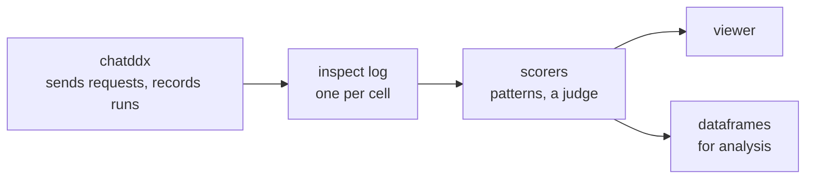

# inspect-ai for chatddx

Sep 24, 2026 · @user

## What inspect-ai is

inspect-ai is an open-source Python framework for evaluating language models, from the UK AI Security Institute. We have version 0.3.263 installed.

An evaluation is a *task* with three parts:

- a **dataset** of samples, each an input and a target: what a good answer holds;
- a **solver**, which gets the model's answer;
- one or more **scorers**, which grade each answer against its target.

Each evaluation writes a **log** of every sample: its messages, answer and scores. A viewer shows the log, and a dataframe API reads it for analysis.

## How it fits chatddx

chatddx keeps sending the requests, and inspect takes over once an answer is in. Letting inspect send them was ruled out in `data-generation.md` §5: it doesn't send `top_k` to vLLM, and it strips keywords from our JSON schemas.

chatddx writes what it ran as inspect logs (`new-datamodel.md` §4). A case becomes a sample, a replicate an epoch, a cell (a configuration on a stack) a log, and a batch an eval set.

## What it brings to scoring

The main gain is a judge: a model reads each answer beside its target and grades it, much as a clinician would. Synonyms, spellings, paraphrase and Swedish compounds then need no pattern of their own.

Today every wording that counts has to be foreseen. Run through our pattern code:

- `biliary & (colic | stone*)` finds "biliary colic", but misses "symptomatic cholelithiasis" and "gallstones".
- `hypocalcemia` misses "hypocalcaemia" and the Swedish "hypokalcemi".
- `scad | dissection | dissektion` misses "spontan kranskärlsdissektion", since a Swedish compound is one word.

What inspect adds:

- **A judge.** `model_graded_qa` and `model_graded_fact` grade with a model and a prompt we can write. Several judges can grade independently, combined by majority vote. The judge's reasoning is kept as the score's explanation.
- **One shape for every score.** A score holds its value, the answer read, an explanation and metadata, so pattern and judge scores sit side by side in one log.
- **Re-scoring without re-running.** `inspect score` holds an existing log to a new or changed scorer, without calling the models under test again.
- **Replicates combined.** Reducers combine a case's replicates by mean, majority or "at least k correct"; metrics add the mean and its standard error.
- **Clinicians overruling scores.** A person can edit a score in the log, and the edit keeps who, when and why.
- **Review and analysis.** The viewer shows each answer beside its scores and the judge's reasoning, and `samples_df` makes the logs one table, a row per trial.

## Where it is and isn't a magic bullet

It is one for wording and plumbing, not for deciding what counts as correct. A judge moves the hard work from writing patterns to validating the judge.

It is a magic bullet for:

- **Wording.** A judge accepts synonyms, spellings, paraphrase and either language without a pattern for each.
- **Plumbing.** Scorers, logs, metrics, re-scoring, review and analysis come ready-made and standard, so we stop building our own.

It isn't one, because:

- **It knows no ground truth.** Clinicians still write each case's target; inspect only compares answers against it.
- **Its own string scorers are no smarter than ours.** `match`, `includes` and `pattern` check an answer's text for a prefix or suffix, a substring or a regex.
- **A judge is an instrument to validate.** Its agreement with clinicians must be measured on a labelled subset before its scores count. It may also favour long or confident answers.
- **A judge adds cost and noise.** It must be pinned (model, version, prompt), costs a call per answer, and may grade the same answer differently twice.
- **It reads text.** Its built-in scorers read the answer's text. Picking the differential, the warning or the disposition out of a structured plan stays with our views.
- **It has no clinical vocabulary.** Nothing maps a diagnosis to SNOMED CT or ICD-10 codes; a judge only approximates that.
- **Language stays ours.** A judge reads Swedish and English, but its agreement must be checked in each. Keeping an experiment in one language is our design (`new-datamodel.md` §12).

## Where to start

Start by writing logs, then add a judge beside the patterns and validate it; the batch comes after.

1. **Write logs.** Export a cell's runs as an inspect log. The viewer and dataframes work at once, and scoring is unchanged.
2. **Our scorers in inspect, and a judge.** Wrap the pattern scorers as inspect scorers, with a test that they score as today. Add a judge for the diagnosis, and measure its agreement with clinicians on a labelled subset.
3. **Then the batch.** Decide who runs a batch: inspect's eval sets, with chatddx still sending each request, or an executor of our own.

Keep the patterns as a cheap, repeatable baseline beside the judge. inspect puts both in one log, comparable answer by answer.
